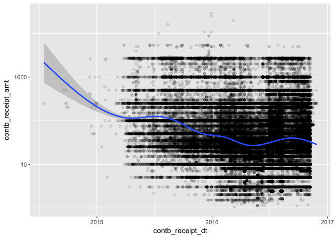
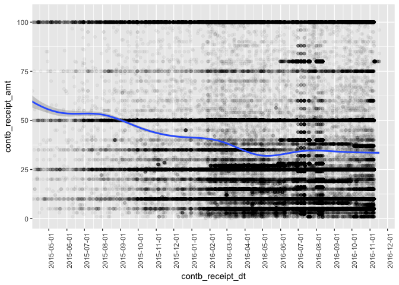
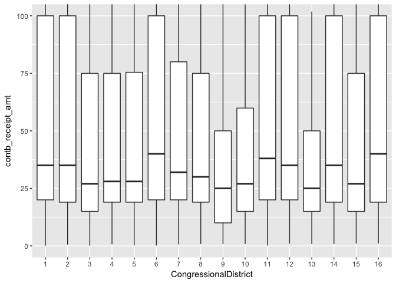
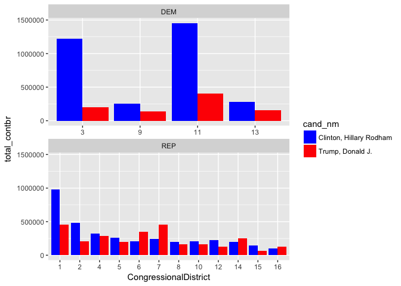

Ohio Presidential Campaign Contribution Analysis by Siddharth Kumar
===================================================================

Introduction
============

In this analysis, I will look at campaign contributions for candidates in the 2016 US Presidential election in the state of Ohio. I'm interested in how contributions varied between political party, occupation, and location within the state. The most important contribution statistics I'll analyze are count, amount, and date.

Univariate Plots Section
========================

    ##        id           cmte_id            cand_id            cand_nm         
    ##  Min.   :     0   Length:164475      Length:164475      Length:164475     
    ##  1st Qu.: 41118   Class :character   Class :character   Class :character  
    ##  Median : 82237   Mode  :character   Mode  :character   Mode  :character  
    ##  Mean   : 82237                                                           
    ##  3rd Qu.:123356                                                           
    ##  Max.   :164474                                                           
    ##                                                                           
    ##   contbr_nm         contbr_city         contbr_st        
    ##  Length:164475      Length:164475      Length:164475     
    ##  Class :character   Class :character   Class :character  
    ##  Mode  :character   Mode  :character   Mode  :character  
    ##                                                          
    ##                                                          
    ##                                                          
    ##                                                          
    ##    contbr_zip        contbr_employer    contbr_occupation 
    ##  Min.   :       10   Length:164475      Length:164475     
    ##  1st Qu.:431109498   Class :character   Class :character  
    ##  Median :440942900   Mode  :character   Mode  :character  
    ##  Mean   :368573923                                        
    ##  3rd Qu.:450131451                                        
    ##  Max.   :458969665                                        
    ##  NA's   :3                                                
    ##  contb_receipt_amt contb_receipt_dt   receipt_desc      
    ##  Min.   :-10800    Length:164475      Length:164475     
    ##  1st Qu.:    16    Class :character   Class :character  
    ##  Median :    28    Mode  :character   Mode  :character  
    ##  Mean   :   120                                         
    ##  3rd Qu.:    80                                         
    ##  Max.   : 29100                                         
    ##                                                         
    ##    memo_cd           memo_text           form_tp         
    ##  Length:164475      Length:164475      Length:164475     
    ##  Class :character   Class :character   Class :character  
    ##  Mode  :character   Mode  :character   Mode  :character  
    ##                                                          
    ##                                                          
    ##                                                          
    ##                                                          
    ##     file_num         tran_id          election_tp       
    ##  Min.   :1003942   Length:164475      Length:164475     
    ##  1st Qu.:1077664   Class :character   Class :character  
    ##  Median :1096260   Mode  :character   Mode  :character  
    ##  Mean   :1095976                                        
    ##  3rd Qu.:1119042                                        
    ##  Max.   :1134173                                        
    ## 

    ## 'data.frame':    164475 obs. of  19 variables:
    ##  $ id               : int  0 1 2 3 4 5 6 7 8 9 ...
    ##  $ cmte_id          : chr  "C00574624" "C00574624" "C00575795" "C00577130" ...
    ##  $ cand_id          : chr  "P60006111" "P60006111" "P00003392" "P60007168" ...
    ##  $ cand_nm          : chr  "Cruz, Rafael Edward 'Ted'" "Cruz, Rafael Edward 'Ted'" "Clinton, Hillary Rodham" "Sanders, Bernard" ...
    ##  $ contbr_nm        : chr  "HOOPER, KEVIN" "JOHNSON, DARIN C. MR." "HILSON, ANN" "HARTFORD, MARK" ...
    ##  $ contbr_city      : chr  "LEESBURG" "MINERVA" "COLUMBUS" "COLUMBUS" ...
    ##  $ contbr_st        : chr  "OH" "OH" "OH" "OH" ...
    ##  $ contbr_zip       : int  451359416 446579402 432141210 432022420 450365038 45249 445051555 437680216 432133419 449032275 ...
    ##  $ contbr_employer  : chr  "SELF EMPLOYED" "CHESAPEAK" "INFORMATION REQUESTED" "NOT EMPLOYED" ...
    ##  $ contbr_occupation: chr  "SALES" "OPERATOR" "INFORMATION REQUESTED" "NOT EMPLOYED" ...
    ##  $ contb_receipt_amt: num  25 25 40 50 57.3 ...
    ##  $ contb_receipt_dt : chr  "07-APR-16" "14-APR-16" "12-APR-16" "06-MAR-16" ...
    ##  $ receipt_desc     : chr  "" "" "" "" ...
    ##  $ memo_cd          : chr  "" "" "X" "" ...
    ##  $ memo_text        : chr  "" "" "* HILLARY VICTORY FUND" "* EARMARKED CONTRIBUTION: SEE BELOW" ...
    ##  $ form_tp          : chr  "SA17A" "SA17A" "SA18" "SA17A" ...
    ##  $ file_num         : int  1077664 1077664 1091718 1077404 1091718 1077404 1091718 1077664 1077664 1077664 ...
    ##  $ tran_id          : chr  "SA17A.1631862" "SA17A.1659621" "C4715778" "VPF7BKYX9P5" ...
    ##  $ election_tp      : chr  "P2016" "P2016" "P2016" "P2016" ...

Hillary Clinton, Bernie Sanders, and Donald Trump received the most contributions of any candidate.

Democrats received the most contributions.

There were more contributions in the primaries than the general election. This makes sense because the primaries have more candidates and take place over a longer time period.

    ##    Min. 1st Qu.  Median    Mean 3rd Qu.    Max. 
    ##  -10800      16      28     120      80   29100

This histogram doesn't tell me much. From first glance, it seems the large majority of people contributed just $0. This is because this data has huge outliers, most notably the maximum contribution at $29,100. Also, there seem to be a sizeable amount of negative contributions with a minimum at -$10,800. I will log transform this data and remove negative values to get a better look at campaign contributions.

This plot reveals that most people contributed in the $1 - $100 range. But a significant amount of people also contributed thousands of dollars as well.

    ##         Min.      1st Qu.       Median         Mean      3rd Qu. 
    ## "2014-07-17" "2016-02-29" "2016-05-31" "2016-05-16" "2016-08-25" 
    ##         Max. 
    ## "2016-11-28"

Although contributions began as early as July 2014, they really began to take off in mid 2015. I'll zoom into the distribution by removing all contributions before June 2015.

I see three distinct peaks when contribution counts were the highest in April, July, and November of 2016.

Since there were over 6,000 occupations listed in the dataset, I subsetted the data to only include occupations with atleast 1,000 contributions. Most contributions came from those who are retired and not employed, with significant contributions coming from attorneys, homemakers, physicians, professors, and teachers.

This plot shows that Columbus and Cincinnati had the most contributions of any city, each with more than 15,000. Cleveland had the next highest with just over 5,000.

In addition to city, I'd like to see how contributions varied between congressional districts.

Most contributions came from the 1st, 3rd, and 11th districts -- which happen to be where the 3 biggest cities are located: Cincinnati, Columbus, and Cleveland respectively.

Univariate Analysis
===================

### What is the structure of your dataset?

This dataset has 164,475 observations of 19 variables. It includes campaign contribution information for 24 candidates in the 2016 primary and general elections. I imported another dataset to include candidate party affiliation. That variable has 3 values of 'DEM', 'REP', and 'OTHER'.

Notable observations:
<ul>
<li>
Most contributions came from Democrats
</li>
<li>
Most contributions were in the primaries
</li>
<li>
Most people contributed in the $1 - $100 range
</li>
<li>
Most contributions came in July and November of 2016
</li>
<li>
Columbus and Cincinnati contributed the most of any other city
</li>
<li>
Most contributions came from retirees and the unemployed
</li>
</ul>
### What is/are the main feature(s) of interest in your dataset?

The main features I'd like to study are number of contributors, contribution amount and countributor location (city/zip code/congressional district). I'd like to facet this data on candidate party affiliation to see how contributions for different parties varied in different congressional districts. \#\#\# What other features in the dataset do you think will help support your investigation into your feature(s) of interest? Other interesting features are contribution date and contributor occupation. I'd also like to facet this data on candidate party affiliation to compare contributors based on their political leaning.

### Did you create any new variables from existing variables in the dataset?

I imported a dataset from fec.gov that included candidate party affiliations for all candidates. I also imported a datset to map zip codes to congressional districts from census.gov and used that to map contribution data to election results data by congressional district. The results data is from dailykos.com.

### Of the features you investigated, were there any unusual distributions? Did you perform any operations on the data to tidy, adjust, or change the form of the data? If so, why did you do this?

The candidate party affiliation data originally included parties such as 'Independent', 'Green', and 'Libertarian'. Since there were so few contributions in those parties, I combined them into an 'Other' field. I also log transformed the contributor amount data to get a better look at the long tail distribution.

Bivariate Plots Section
=======================

From this plot, it seems Democrats contributed more in the $1 - $100 range, while Republicans outspent Democrats in the $1000 + range. I'll zoom in to confirm my suspicions.

Republicans contributed more than Democrats in ranges over $1,000. There were even some contributions in the $10,000 - $30,000 range.

I'm curious how contribution amounts varied between candidates.

This plot is surprising because several candidates that raised comparatively less money than others, had much higher mean contributions. Examples of these candidates are Jeb Bush, Lindsey Graham, Martin O'Malley, and George Pataki. I assume these candidates received fewer, but higher contribution amounts.

Looking at the median contribution amount data, candidates who had high mean contributions like Jeb Bush and Lindsey Graham are no longer as prominent. This is most likely because these candidates had large outlier contributions that skewed the mean. However Martin O'Malley and George Pataki still have the highest medians, meaning they probably had less outliers. I'll investigate outliers in contribution amounts using box plots.

This plot indicates that John Kasich had massive outliers in contribution amounts. This explains why his mean contribution amount was much higher than his median amount. I want to see how candidates compared with each other more closely, so I'll remove outliers, and log transform the amounts.

Removing the outliers, I find that most candidates had modest donations less than $100. However candidates like Jeb Bush, Lindsey Graham, John Kasich, Martin O'Malley, and Scott Walker received very large donations that skewed the interquartile range.

Next I want to see how contributions varied between political party.

According to this boxplot, the median Republican contribution was roughly double the median Democratic donation. Republican contribution amounts also spanned an interquartile range that was double than the Democratic interquartile range.

Here I see that Clinton, Kasich, and Trump received the most money in contributions. I wonder if Clinton and Trump had a higher total contribution amount because they ran in both primary and general elections. I'll study this later in the analysis. First, I'll compare counts between candidates in both the primary and general elections.

This plot affirms my belief that Clinton and Trump were able to raise more money because they had more opportunities in both elections. Looking at just the primaries, Bernie Sanders had the most contributors of any candidate.

More Democrats contributed than Republicans in both elections, especially the general election. I wonder how contributions varied over time.

In the beginning Republican contributions outweighed Democratic ones up until early January. From then on, Democrats contributions were much greater until July 2016, when Republican contributions skyrocketed. Afterward, Democrats overtook Republicans again, with counts over 7,000 compared to Republican counts barely reaching 500. The black vertical line represents the date that both candidates officially announced their candidacy in the general election.

Next I want to analyze how contribution amounts varied over time.

Although the smoother indicates that contribution amounts decreased over time, it's hard to get a good idea of what the relationship between contribution amount and date are. Since most contributions are below $100, I'll subset the data to only include those contributions to see if theres a clear relationship.

I trust this smoother more than the previous since the data here is more representative of the total population's contributions. It indicates that while there was some fluctation, contribution amount slightly decreased over time.

I find that occupations like 'Not employed', 'Professor', and 'Teacher' had more Democrats contribute while 'Owner' and 'President' were predominately Republican.

Owner and President had the highest median contribution, while manager, professor and teacher had the lowest.

From this plot I see that democratic contributions outweighed republicans in every city with atleast 800 contributions, except for Beavercreek, Loveland, and Mansfield.

Democrats out-contributed Republicans in most districts, but especially the 3rd, 9th, 11th, and 13th. I wonder if this had any bearing on the winner of these districts in the general election.

Next I'd like to analyze contribution amounts per congressional district.

The highest median contributions came from districts 6, 11, and 16. I'll make this plot again by grouping on winning party, to see how districts where the Democratic candidate won compare to districts where the Republican candidate won.

Contributions in Republican won districts were slightly higher than contributions in Democrat won districts.

Bivariate Analysis
==================

### Talk about some of the relationships you observed in this part of the investigation. How did the feature(s) of interest vary with other features in the dataset?

I observed the relationships between contribution counts and amounts between several categorical variables-- candidate, political party, contributor location (city, congressional district). I also compared contribution counts by political party and election type.
<ul>
<li>
Less popular candidates like Lindsey Graham, John Kasich, and Scott Walker had the highest median contribution amounts.
</li>
<li>
Bernie Sanders had the most contributions in the primaries
</li>
<li>
When looking at contribution counts across all congressional districts, I found that the districts that had significantly more Democrat than Republican contributions, ended up being won by the Democratic candidate.
</li>
<li>
Hillary Clinton received more contributions than Donald Trump in every congressional district
</li>
<li>
Republican median contribution amounts were twice as much as Democrat median contribution amounts
</li>
</ul>
### Did you observe any interesting relationships between the other features (not the main feature(s) of interest)?

The other categorical variables I observed were contributor occupation and contribution date.
<ul>
<li>
Teachers, professors, and the unemployed contributed mostly to Democrats, while owners and presidents contributed mostly to Republicans.
</li>
<li>
Contributors with the occupation 'president' had the highest median contribution -- almost $200.
<li>
Contribution amount slightly decreased over time
</li>
<li>
Republican contributions spiked on July 8, 2016 and Democrat contributions spiked on November 3, 2016.
</li>
</ul>
### What was the strongest relationship you found?

Republicans median contribution amounts were twice as much as Democrat median contribution amounts. From this, I wonder if it's safe to assume that Republicans generally donate more than Democrats. This was also evident in the occupation data, as jobs like 'president' and 'owner' had the highest median contributions, and mostly consisted of Republican contributors. On the other hand, jobs like 'teacher' and 'professor' were among the lowest contributors, and mostly consisted of Democrats.

Multivariate Plots Section
==========================

Previously, I compared contribution counts between candidates in both the primary and general elections. Now I will compare contribution amounts.

The two main candidates -- Clinton and Trump -- received the most contributions in the general election. Kasich, Cruz and Rubio still received contributions even after they lost in the primaries. It's important to note that I subset the data to only include candidates that received atleast $15,000 in total contributions.

The total Republican contribution was higher than the total Democrat contribution in the primaries. However, the total Democrat contribution was higher than the Republicans in the general election.

Here, I faceted the data on the party who won each district in the general election. The first plot represents districts where the Democratic candidate won, and the second plot represents districts where the Republican candidate won. I noticed before that Democrats especially out-contributed Republicans in the 3rd, 9th, 11th, and 13th districts -- these happen to be the same districts where the Democratic candidate won.

One problem with this plot is that it shows contributions by party. Since the election is really just between two people, it's not realistic to say that supporters of candidates who didn't win their primaries, will still vote along party lines (eg. Supporters of Bernie Sanders will not necessarily vote for Hillary Clinton). Therefore, I will make this plot again with contributions for just the two presidential nominees (Hillary Clinton and Donald Trump).

I was not expecting this, as now it shows that Hillary Clinton received significantly more contributions than Donald Trump, even in districts that Trump won. This means that Ohio Republican contributors were also contributing significantly toward other candidate(s).

Republicans contributed more money in nearly every district, with the exceptions being the 3rd, 9th, and 11th -- which happen to be all districts where the Democratic candidate won. As I did previously, I'll subset this data to only include the presidential nominees, Hillary Clinton and Donald Trump.

Hillary Clinton raised more money than Donald Trump in 11 out of 16 districts.

The median Republican contribution was higher than the median Democrat contribution for all occupations that had atleast 1,000 contributions.

Republican contribution amounts were consistently higher than Democratic amounts, except for a short period of time in late June / early July of 2016. Both parties contribution amounts trended downward until July 2016. However, Republican contributions significantly increased shortly after Donald Trump was announced as the Republican nominee.

Multivariate Analysis
=====================

### Talk about some of the relationships you observed in this part of the investigation. Were there features that strengthened each other in terms of looking at your feature(s) of interest?

<ul>
<li>
Republicans contributed significantly more than Democrats in the primaries, however Democrats contributed more money in the general election
</li>
<li>
Hillary Clinton had more contributions than Donald Trump in all congressional districts, and raised more than him in 11 districts
</li>
<li>
When comparing Republican and Democratic contributions across professions, Republicans had a higher median contribution than Democrats for all professions that had atleast 1,000 contributions.
</li>
<li>
Republicans generally gave more money per contribution over time.
</li>
</ul>
Many of these plots affirmed a suspicion that Republicans were generally more generous in their campaign contributions.

### Were there any interesting or surprising interactions between features?

Hillary Clinton raised more money than Donald Trump in 11 out of 16 districts. This surprised me because Republicans as a whole nearly outraised Democrats in all districts. This tells me that Donald Trump probably wasn't the most popular Republican candidate in Ohio.

------------------------------------------------------------------------

Final Plots and Summary
=======================

### Plot One

### Description One

In the beginning Republican contributions outweighed Democratic ones up until early January. From then on, Democrats contribution counts were much greater until July 2016, when Republican contributions skyrocketed. Afterward, Democrats overtook Republicans again, with counts over 7,000. The black vertical line represents the date that both candidates officially announced their candidacy in the general election.

I was curious as to what might have caused the Republican spike on July 9th 2016, and the Democratic spike on November 4th 2016. With Google, I found that the biggest news stories around these times were the Dallas police shooting and James Comey announcing his investigation on Hillary Clinton's emails, respectively.

### Plot Two

### Description Two

Democrats contributed more in the $1 - $100 range, while Republicans outspent Democrats in the $1000 + range. This plot is log transformed on the y-axis because it was originally a very long tailed distribution. After transforming, the Democratic distribution looks more normal than the Republican distribution. Republicans had less donations under $30 than Democrats, but more donations over $100.

### Plot Three

### Description Three

Hillary Clinton received significantly more contributions than Donald Trump in all congressional districts. This surprised me because Clinton looks to be much more popular than Donald Trump according to this plot. This didn't seem to have an impact on voting patterns because Trump ended up winning Ohio anyway.

------------------------------------------------------------------------

Reflection
==========

In my analysis, I was very interested in how contributions varied between Republicans and Democrats across different variables. I found the most interesting comparisons when analyzing contribution amount and contribution location. It was surprising to see how Republicans consistently contributed more money than Democrats. I saw this when faceting contribution amounts on occupation and congressional district, and when plotting them over time. Although political affiliation was a major component of this analysis, it wasn't originally included in the dataset. This proved to be a minor difficulty, as I had to find a supplemental dataset that included this information. Luckily, I was able to find a "Candidate Master File" on fec.gov, that merged with my dataset flawlessly. A much bigger challenge was finding election results per congressional district. I wanted to have this data in order to compare contributions per congressional district based on the political party that won that district. Most Google searches did not return what I was looking for (atleast for free), since the election was so recent. The best source I found was dailykos.com, which was collecting this data from each congressional district from all states. I was able to confirm the validity of this data from the Associated Press.

A limitation of this analysis is that it doesn't include vote counts to compare contributions to. Had I been able to include this, I would've been able to get a better idea of how contribution counts and amounts correlate to vote counts. This is something that I would like to include to investigate this data further. Another way to expand this analysis would be to include contributions from previous elections, and study how trends change.
